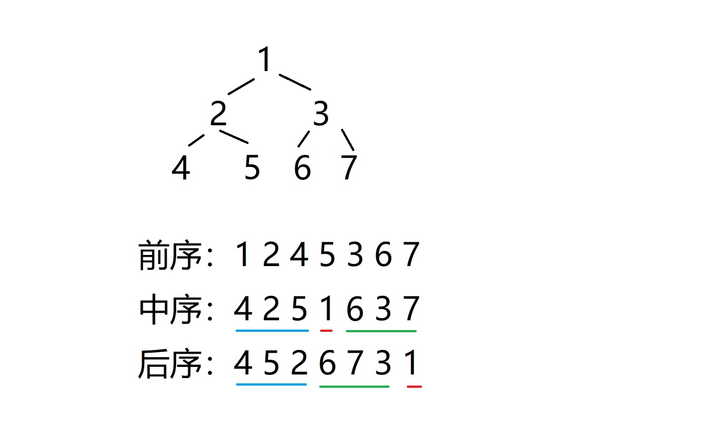

# `（中等）`  [106.construct-binary-tree-from-inorder-and-postorder-traversal 从中序与后序遍历序列构造二叉树](https://leetcode-cn.com/problems/construct-binary-tree-from-inorder-and-postorder-traversal/)

### 题目描述
<p>根据一棵树的中序遍历与后序遍历构造二叉树。</p>

<p><strong>注意:</strong><br>
你可以假设树中没有重复的元素。</p>

<p>例如，给出</p>

<pre>中序遍历 inorder =&nbsp;[9,3,15,20,7]
后序遍历 postorder = [9,15,7,20,3]</pre>

<p>返回如下的二叉树：</p>

<pre>    3
   / \
  9  20
    /  \
   15   7
</pre>


---
### 思路
```
根据中序遍历和后序遍历的特点，  
先由后序遍历的最后一个结点拿到根节点，
再通过根节点在中序遍历出的位置，
确定左子树和右子树的中序遍历数组，
根据其个数，也就确认了后序遍历的左右子树数组，
递归。
```


### 答题
``` C++
TreeNode* buildTree(vector<int>& inorder, vector<int>& postorder) 
{
	if (inorder.size() != postorder.size() || inorder.size() == 0) return nullptr;

	int val = postorder[postorder.size() - 1];
	bool f = false;
	vector<int> left_inorder;
	vector<int> right_inorder;
	for (auto n : inorder)
	{
		if (n == val) {	f = true; continue; }

		if (!f) left_inorder.push_back(n);
		else right_inorder.push_back(n);
	}
	vector<int> left_postorder;
	vector<int> right_postorder;
	for (auto n : postorder)
	{
		if (left_inorder.size() > left_postorder.size()) left_postorder.push_back(n);
		else if (right_inorder.size() > right_postorder.size()) right_postorder.push_back(n);
	}

	TreeNode *root = new TreeNode(val);
	root->left = buildTree(left_inorder, left_postorder);
	root->right = buildTree(right_inorder, right_postorder);
	return root;
}
```

### 其它
``` C++
TreeNode* buildTree(vector<int>& inorder, vector<int>& postorder) {
	if (inorder.empty())
		return NULL;
	int i = inorder.size() - 1, j = postorder.size() - 1;
	stack<TreeNode*> s;
	TreeNode* t = new TreeNode(postorder[j]);
	TreeNode *p = NULL;
	s.push(t);
	j--;
	while (j >= 0) {
		while (!s.empty() && inorder[i] == s.top()->val) {
			p = s.top();
			s.pop();
			i--;
		}
		TreeNode* node = new TreeNode(postorder[j]);
		if (p)
			p->left = node;
		else if (!s.empty())
			s.top()->right = node;
		s.push(node);
		p = NULL;
		j--;
	}
	return t;
}
```

