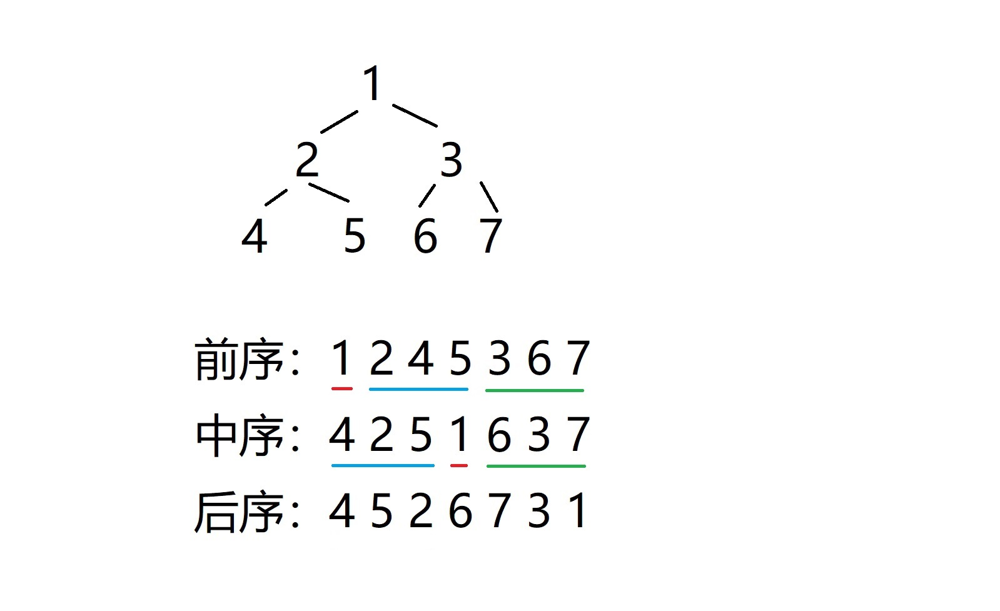

# `（中等）` [105.construct-binary-tree-from-preorder-and-inorder-traversal 从前序与中序遍历序列构造二叉树](https://leetcode-cn.com/problems/construct-binary-tree-from-preorder-and-inorder-traversal/)

### 题目描述
<p>根据一棵树的前序遍历与中序遍历构造二叉树。</p>

<p><strong>注意:</strong><br>
你可以假设树中没有重复的元素。</p>

<p>例如，给出</p>

<pre>前序遍历 preorder =&nbsp;[3,9,20,15,7]
中序遍历 inorder = [9,3,15,20,7]</pre>

<p>返回如下的二叉树：</p>

<pre>    3
   / \
  9  20
    /  \
   15   7</pre>


---
### 思路
```
根据前序遍历和中序遍历的特点，  
先由前序遍历的第一个结点拿到根节点，
再通过根节点在中序遍历出的位置，
确定左子树和右子树的中序遍历数组，
根据其个数，也就确认了前序遍历的左右子树数组，
递归。
```


### 答题
``` C++
TreeNode* buildTree(vector<int>& preorder, vector<int>& inorder) 
{
	if (preorder.size() != inorder.size() || inorder.size() == 0) return nullptr;

	int val = preorder[0];
	bool f = false;
	vector<int> left_inorder;
	vector<int> right_inorder;
	for (auto n : inorder)
	{
		if (n == val) { f = true; continue; }

		if (!f) left_inorder.push_back(n);
		else right_inorder.push_back(n);
	}
	vector<int> left_preorder;
	vector<int> right_preorder;
	for (auto n : preorder)
	{
		if (n == val) continue;
		if (left_inorder.size() > left_preorder.size()) left_preorder.push_back(n);
		else if (right_inorder.size() > right_preorder.size()) right_preorder.push_back(n);
	}

	TreeNode *root = new TreeNode(val);
	root->left = buildTree(left_preorder, left_inorder);
	root->right = buildTree(right_preorder, right_inorder);
	return root;
}
```

