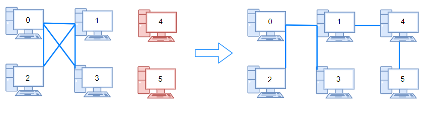

# `（中等）` [1319.number-of-operations-to-make-network-connected 连通网络的操作次数](https://leetcode-cn.com/problems/number-of-operations-to-make-network-connected/)

[contest](https://leetcode-cn.com/contest/weekly-contest-171/problems/number-of-operations-to-make-network-connected/)

### 题目描述
<p>用以太网线缆将&nbsp;<code>n</code>&nbsp;台计算机连接成一个网络，计算机的编号从&nbsp;<code>0</code>&nbsp;到&nbsp;<code>n-1</code>。线缆用&nbsp;<code>connections</code>&nbsp;表示，其中&nbsp;<code>connections[i] = [a, b]</code>&nbsp;连接了计算机&nbsp;<code>a</code>&nbsp;和&nbsp;<code>b</code>。</p>
<p>网络中的任何一台计算机都可以通过网络直接或者间接访问同一个网络中其他任意一台计算机。</p>
<p>给你这个计算机网络的初始布线&nbsp;<code>connections</code>，你可以拔开任意两台直连计算机之间的线缆，并用它连接一对未直连的计算机。请你计算并返回使所有计算机都连通所需的最少操作次数。如果不可能，则返回&nbsp;-1 。&nbsp;</p>
<p>&nbsp;</p>
<p><strong>示例 1：</strong></p>
<p><strong></strong></p>
<pre><strong>输入：</strong>n = 4, connections = [[0,1],[0,2],[1,2]]
<strong>输出：</strong>1
<strong>解释：</strong>拔下计算机 1 和 2 之间的线缆，并将它插到计算机 1 和 3 上。
</pre>

<p><strong>示例 2：</strong></p>
<p><strong></strong></p>
<pre><strong>输入：</strong>n = 6, connections = [[0,1],[0,2],[0,3],[1,2],[1,3]]
<strong>输出：</strong>2
</pre>

<p><strong>示例 3：</strong></p>
<pre><strong>输入：</strong>n = 6, connections = [[0,1],[0,2],[0,3],[1,2]]
<strong>输出：</strong>-1
<strong>解释：</strong>线缆数量不足。
</pre>

<p><strong>示例 4：</strong></p>
<pre><strong>输入：</strong>n = 5, connections = [[0,1],[0,2],[3,4],[2,3]]
<strong>输出：</strong>0
</pre>

<p>&nbsp;</p>
<p><strong>提示：</strong></p>
<ul>
	<li><code>1 &lt;= n &lt;= 10^5</code></li>
	<li><code>1 &lt;= connections.length &lt;= min(n*(n-1)/2, 10^5)</code></li>
	<li><code>connections[i].length == 2</code></li>
	<li><code>0 &lt;= connections[i][0], connections[i][1]&nbsp;&lt; n</code></li>
	<li><code>connections[i][0] != connections[i][1]</code></li>
	<li>没有重复的连接。</li>
	<li>两台计算机不会通过多条线缆连接。</li>
</ul>

---
### 思路
```

```


### 答题
``` C++
struct DSU {
    DSU(int n) : data(n, -1) {}

    bool unionSet(int x, int y) {
        x = root(x);
        y = root(y);
        if (x == y) return false;

        if (data[y] < data[x]) std::swap(x, y);
        data[x] += data[y];
        data[y] = x;
        return true;
    }

    bool same(int x, int y) { return root(x) == root(y); }

    int root(int x) { return data[x] < 0 ? x : data[x] = root(data[x]); }

    int size(int x) { return -data[root(x)]; }

    std::vector<int> data;
};

class Solution {
public:
    int makeConnected(int n, vector<vector<int>>& connections) {
        int ans = n;
        DSU dsu(n);
        for (auto& c : connections) {
            ans -= (dsu.unionSet(c[0], c[1]));
        }        
        return connections.size() < n - 1 ? -1 : ans - 1;
    }
};
```


