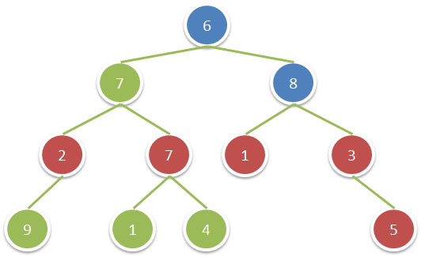

# `（中等）` [5145.sum-of-nodes-with-even-valued-grandparent 祖父节点值为偶数的节点和](https://leetcode-cn.com/problems/sum-of-nodes-with-even-valued-grandparent/)

[contest](https://leetcode-cn.com/contest/biweekly-contest-17/problems/sum-of-nodes-with-even-valued-grandparent/)

### 题目描述
<p>给你一棵二叉树，请你返回满足以下条件的节点权值和：该节点的祖父节点的值为偶数。（如果一个节点的父节点也存在父节点，那么我们称之为该节点的祖父节点。）</p>

<p>如果不存在祖父节点权值为偶数的节点，那么返回&nbsp;<code>0</code> 。</p>

<p>&nbsp;</p>

<p><strong>示例：</strong></p>

<p><strong></strong></p>

<pre><strong>输入：</strong>root = [6,7,8,2,7,1,3,9,null,1,4,null,null,null,5]
<strong>输出：</strong>18
<strong>解释：</strong>图中红色节点的祖父节点的值为偶数，蓝色节点为这些红色节点的祖父节点。
</pre>

<p>&nbsp;</p>

<p><strong>提示：</strong></p>

<ul>
	<li>树中节点的数目在&nbsp;<code>1</code> 到&nbsp;<code>10^4</code>&nbsp;之间。</li>
	<li>每个节点的值在&nbsp;<code>1</code> 到&nbsp;<code>100</code> 之间。</li>
</ul>

            

---
### 思路
```
```


### 答题
``` C++
int getChildSum(TreeNode* node)
{
	int ret = 0;
	if (node == nullptr) return ret;
	ret += (node->left != nullptr) ? node->left->val : 0;
	ret += (node->right != nullptr) ? node->right->val : 0;
	return ret;
}

void dfs(TreeNode* node, int& ans)
{
	if (node == nullptr) return;
	if (node->val % 2 == 0)
	{
		ans += getChildSum(node->left);
		ans += getChildSum(node->right);
	}
	dfs(node->left, ans);
	dfs(node->right, ans);
}

int sumEvenGrandparent(TreeNode* root) 
{
	int ans = 0;
	dfs(root, ans);
	return ans;
}
```


