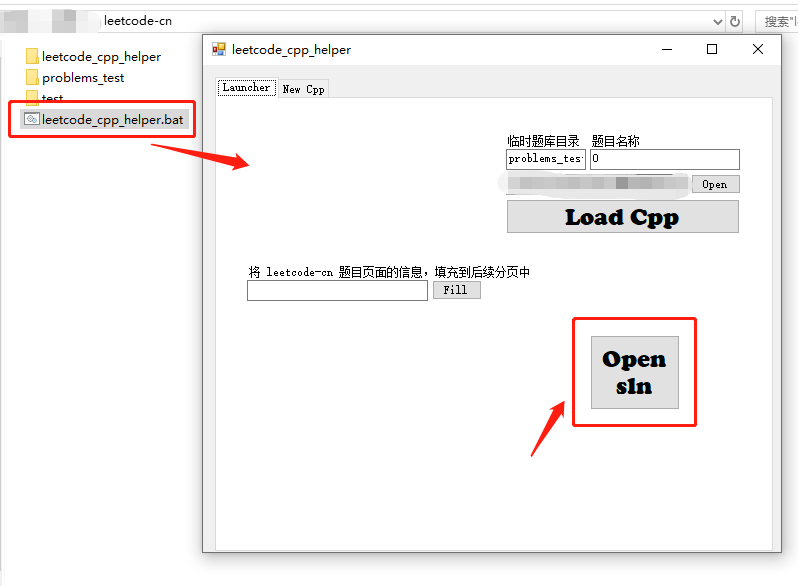
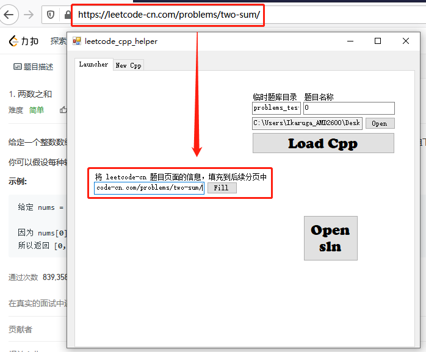
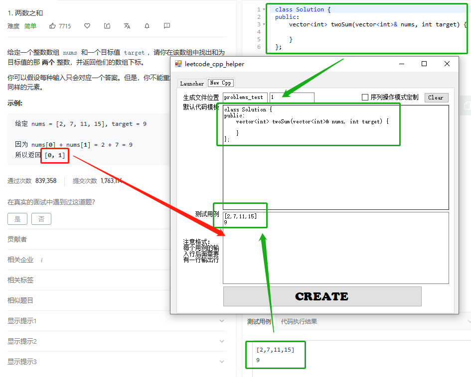
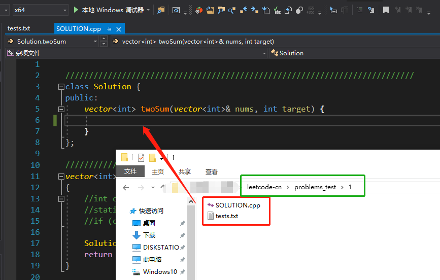
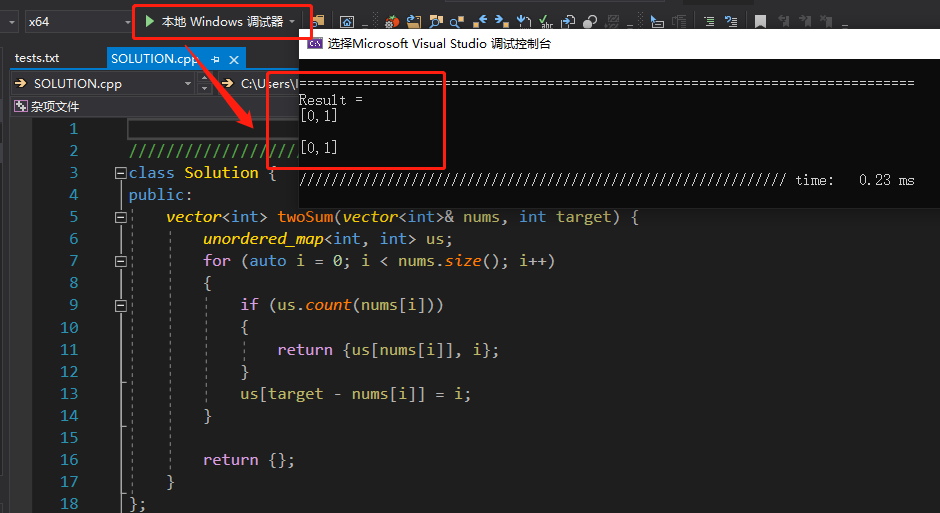
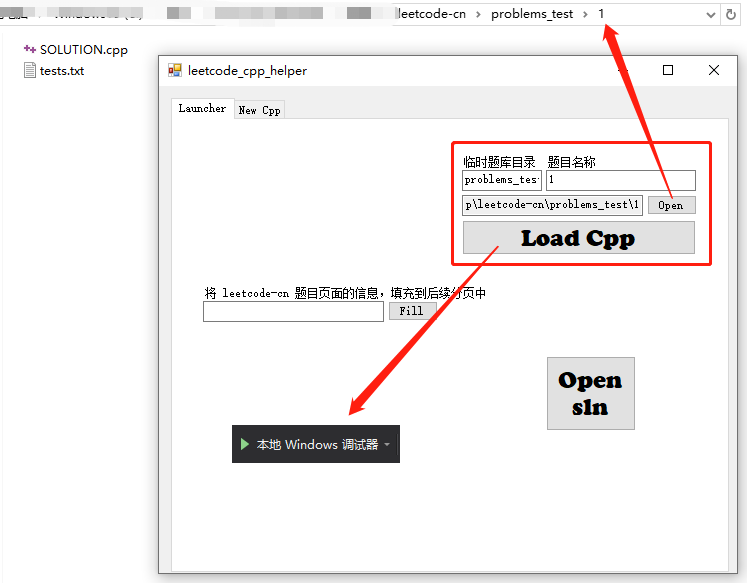
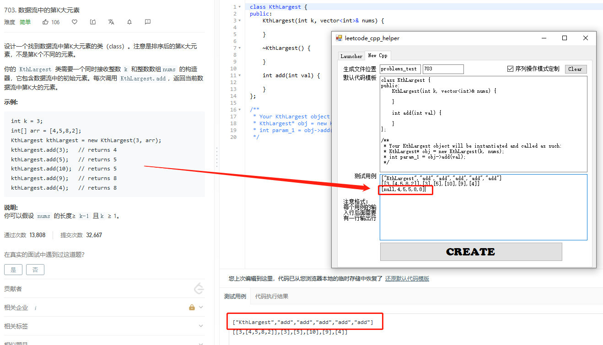

# leetcode-cn

## Quick Start

1. 打开 `leetcode_cpp_helper.exe` ，点击 `Open sln` 按钮打开测试工程 `Leetcode.sln`

   

2. 将 [leetcode-cn](https://leetcode-cn.com/) 中的题目页面地址填入，点击 `Fill` 按钮获取题目信息

   

3. 工具会自动获取**默认代码**和一个**测试用例**的输入行

4. 还需要将答案补充到后面，作为输出行

   

5. 点击 `Create` 按钮，生成 `SOLUTION.cpp` 和 `tests.txt` 文件

6. 将其拖入至已打开的 `Leetcode.sln` 中

   

7. 编写答题代码

8. 点击 `本地调试` 按钮，运行并查看结果

   

9. 如果需要切换到已有的题目，输入目录名，点击 `Load Cpp` 按钮，即可调试

      

10. 如果是**序列操作模式**，生成时要勾选选项

11. 注意有些题目可能没有答案行，需要按格式填入

    

